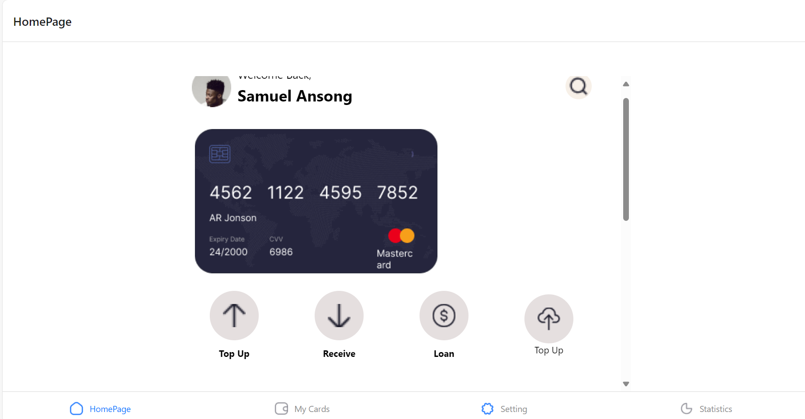
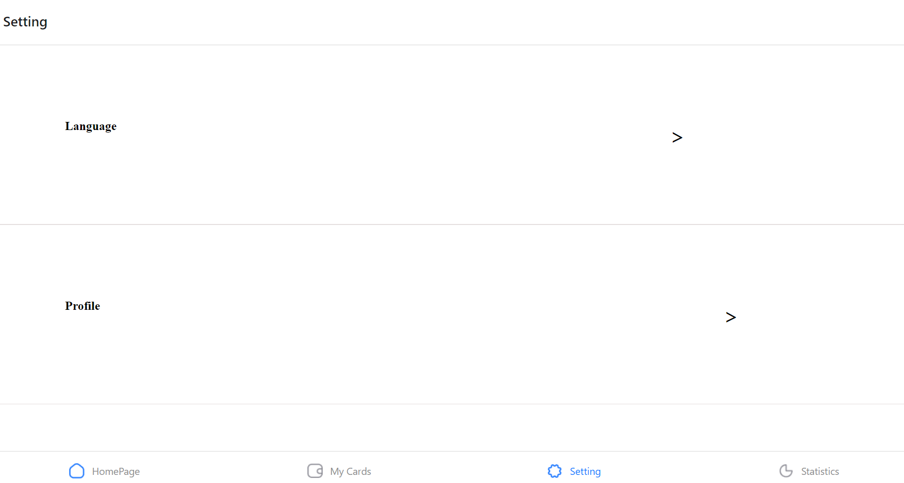
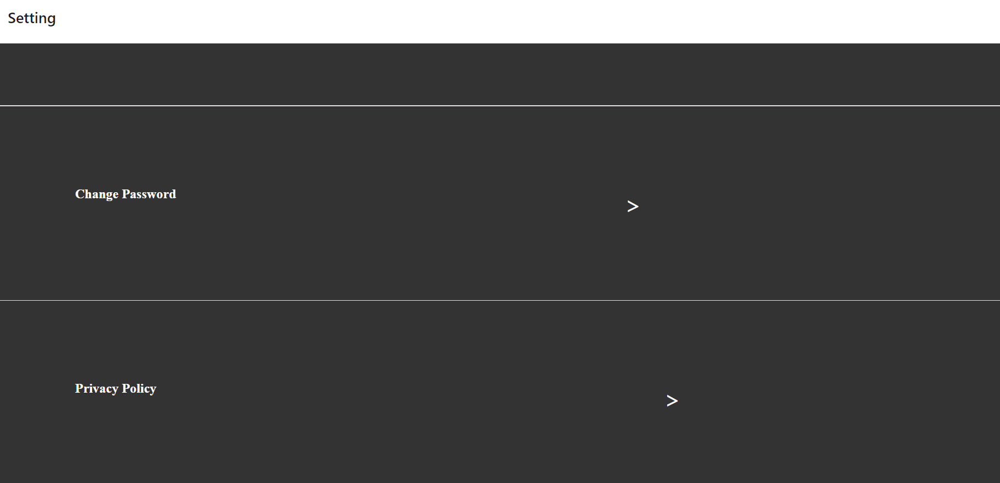

# rn-assignment5-11093177
OVERVIEW:
This project is a React Native application that includes a bottom tab navigator with four  main screens: HomePage and Settings. The HomePage screen contains several components including Screen, Frame2, Functions, and Transaction. The Settings screen allows toggling between light and dark themes using a context.
.
PROJECT STRUCTURE:
├── App.js
├── Components
│   ├── HomePage.js
│   ├── Settings.js
│   ├── ThemeContext.js
│   ├── Screen.js
│   ├── Frame2.js
│   ├── Functions.js
│   └── Transaction.js
└── README.md

Components
App.js
The main entry point of the application, setting up the bottom tab navigator with HomePage and Settings screens wrapped inside a ThemeProvider.

HomePage.js
The HomePage component renders several other components (Screen, Frame2, Functions, and Transaction) inside a scrollable view.

Settings.js
The Settings component allows users to toggle between light and dark themes using a context.

ThemeContext.js
Defines a context for managing theme (light or dark) across the application.

Screen.js, Frame2.js, Functions.js, Transaction.js
Placeholder components for different sections within the HomePage. These should be implemented according to your specific application requirements.

SCREENSHOTS:

